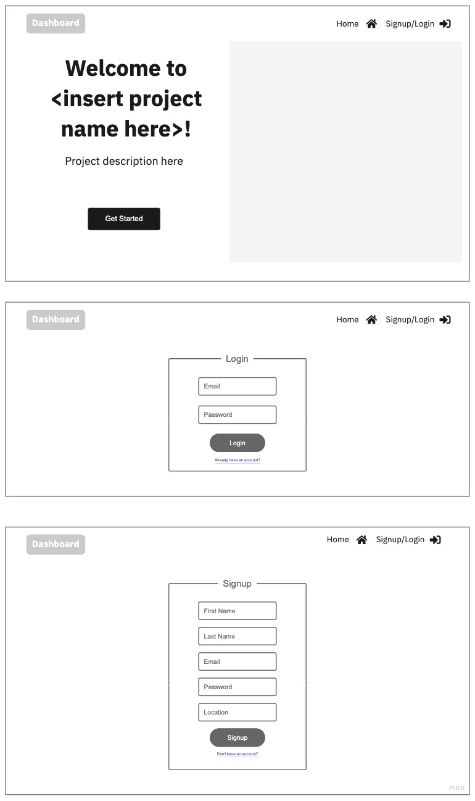
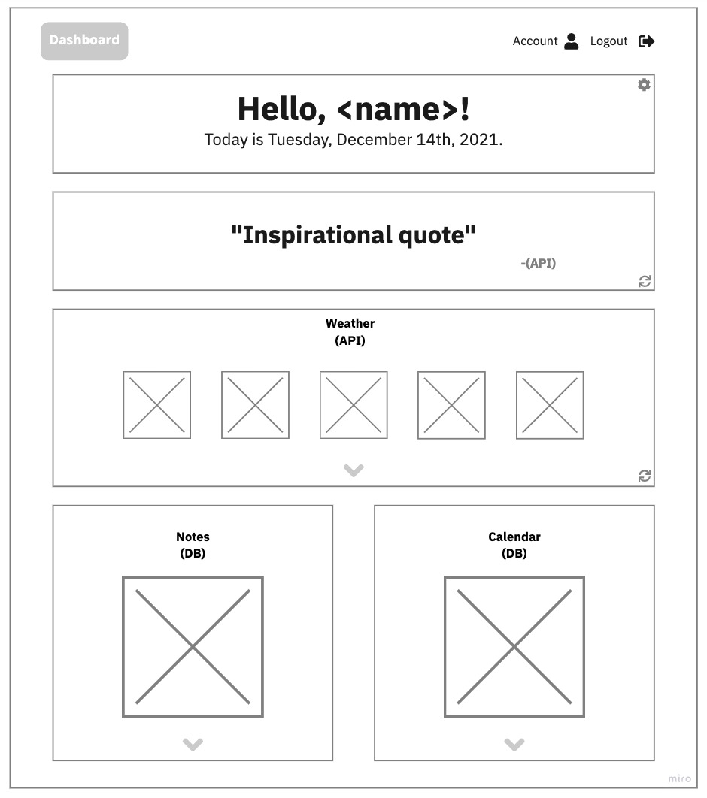
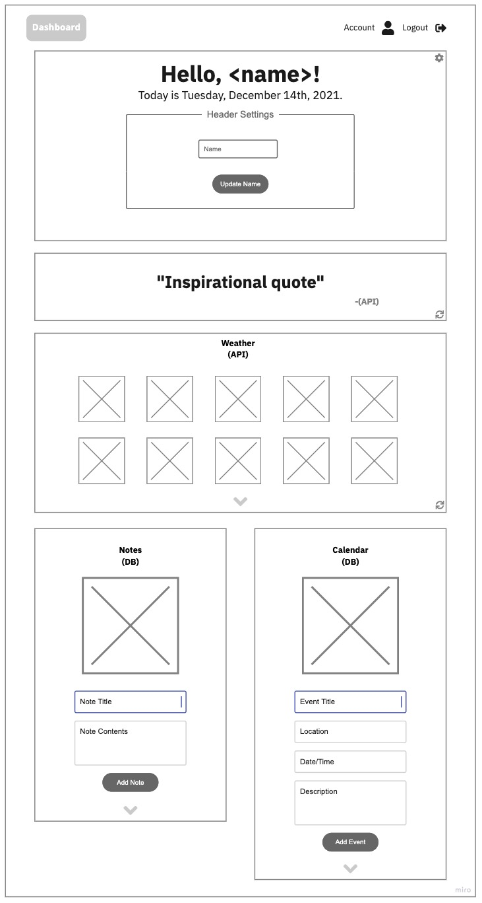
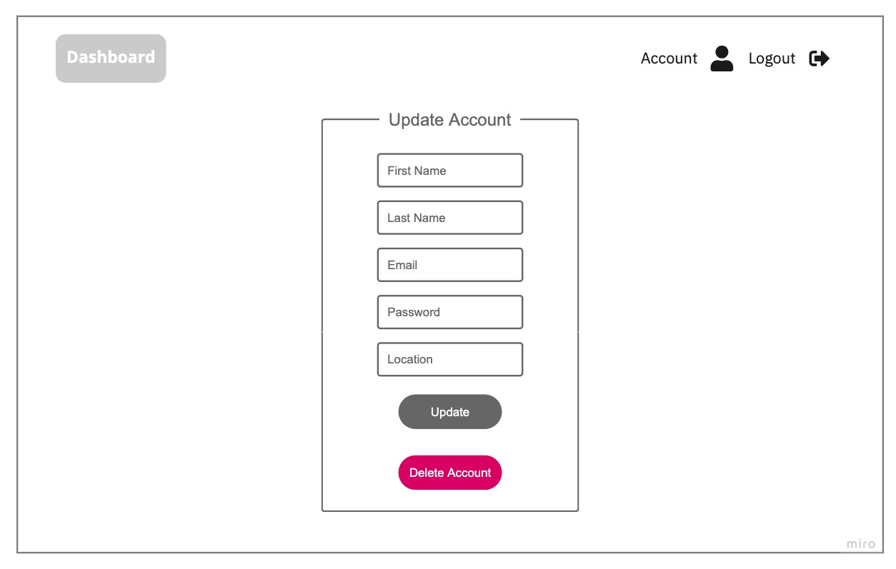
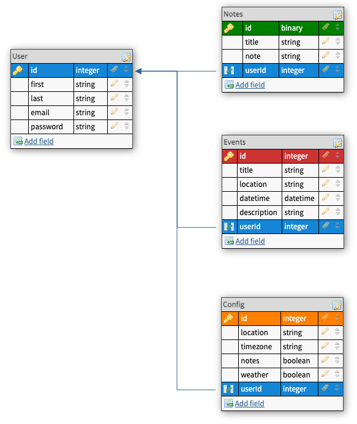
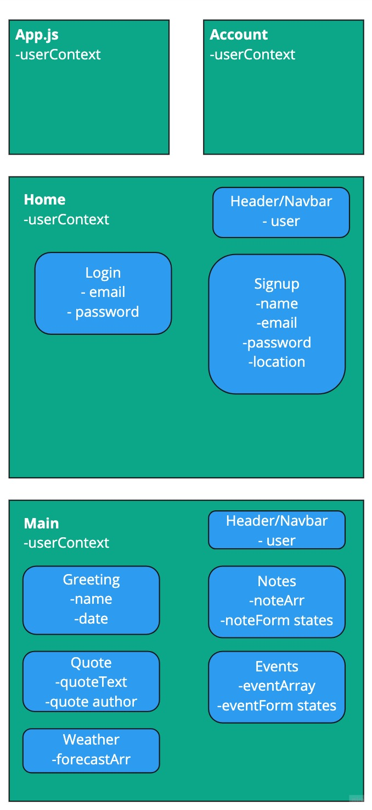

<<<<<<< HEAD
# PROJECT TITLE: TBA

---

### OVERVIEW

Personal dashboard that aggregates all the information you need for the day. Contains weather (api), upcoming events/to-do-list, notes section

---

### WIREFRAME

---

### USER STORIES
- When I first visit, I am shown a homepage with site description.
- When I click on signup/login, I am taken to the login page to login
- When I click on the "Get Started" button or the "Don't have an account?" link? on the login page, I am taken to the signup page to enter my information
- After logging in, I am taken to the dashboard which shows my name, current date, an inspiration quote, weather, notes, and a calendar/task list
- When click on any of the cogs for the header, I am able to edit the name in the header
- When I click on any of the reload buttons for quote section, I will be able to see a new quote
- When I click on the reload for the weather section, I am able to get updated weather information
- When I expand the weather section, I am shown more weather detail
- When I expand the notes section, I will be able to add or delete notes
- When I expand the calendar/task list section, I am able to add, delete, or mark an event/task as completed
- When I click on the account link, I am taken to my account information and am able to delete my account
- When I click on the logout link, I am logged out and taken to the home page

---

### ROUTE INVENTORY

| Route | Path | Description |
| :---: | :--- | :--- |
| POST | /user | Create new user |
| PUT | /user/update | Update user information |
| GET | /user | Get user and settings |
| DELETE | /user | Delete user |
| POST | /note | Create note |
| GET | /note | Get all notes |
| DELETE | /note | Delete notes |
| POST | /event | Create event |
| GET | /event | Get all events |
| DELETE | /event | Delete event |

---

### DATABASE ERD

---

### COMPONENT TREE

---

### MVP CHECKLIST
- [ ] Create user
- [ ] Login/logout user
- [ ] Update account information
- [ ] Pull, display, and reload weather from API
- [ ] Add, show, delete events

---

### STRETCH GOALS
- [ ] Add, show, delete notes
- [ ] Editable notes and events
- [ ] Pull, display, and reload quote from API
- [ ] Configurable sections based upon setting choices by user
- [ ] Password hashing and account information encryption
- [ ] Dark mode/Light mode
=======
# Getting Started with Create React App

This project was bootstrapped with [Create React App](https://github.com/facebook/create-react-app).

## Available Scripts

In the project directory, you can run:

### `npm start`

Runs the app in the development mode.\
Open [http://localhost:3000](http://localhost:3000) to view it in your browser.

The page will reload when you make changes.\
You may also see any lint errors in the console.

### `npm test`

Launches the test runner in the interactive watch mode.\
See the section about [running tests](https://facebook.github.io/create-react-app/docs/running-tests) for more information.

### `npm run build`

Builds the app for production to the `build` folder.\
It correctly bundles React in production mode and optimizes the build for the best performance.

The build is minified and the filenames include the hashes.\
Your app is ready to be deployed!

See the section about [deployment](https://facebook.github.io/create-react-app/docs/deployment) for more information.

### `npm run eject`

**Note: this is a one-way operation. Once you `eject`, you can't go back!**

If you aren't satisfied with the build tool and configuration choices, you can `eject` at any time. This command will remove the single build dependency from your project.

Instead, it will copy all the configuration files and the transitive dependencies (webpack, Babel, ESLint, etc) right into your project so you have full control over them. All of the commands except `eject` will still work, but they will point to the copied scripts so you can tweak them. At this point you're on your own.

You don't have to ever use `eject`. The curated feature set is suitable for small and middle deployments, and you shouldn't feel obligated to use this feature. However we understand that this tool wouldn't be useful if you couldn't customize it when you are ready for it.

## Learn More

You can learn more in the [Create React App documentation](https://facebook.github.io/create-react-app/docs/getting-started).

To learn React, check out the [React documentation](https://reactjs.org/).

### Code Splitting

This section has moved here: [https://facebook.github.io/create-react-app/docs/code-splitting](https://facebook.github.io/create-react-app/docs/code-splitting)

### Analyzing the Bundle Size

This section has moved here: [https://facebook.github.io/create-react-app/docs/analyzing-the-bundle-size](https://facebook.github.io/create-react-app/docs/analyzing-the-bundle-size)

### Making a Progressive Web App

This section has moved here: [https://facebook.github.io/create-react-app/docs/making-a-progressive-web-app](https://facebook.github.io/create-react-app/docs/making-a-progressive-web-app)

### Advanced Configuration

This section has moved here: [https://facebook.github.io/create-react-app/docs/advanced-configuration](https://facebook.github.io/create-react-app/docs/advanced-configuration)

### Deployment

This section has moved here: [https://facebook.github.io/create-react-app/docs/deployment](https://facebook.github.io/create-react-app/docs/deployment)

### `npm run build` fails to minify

This section has moved here: [https://facebook.github.io/create-react-app/docs/troubleshooting#npm-run-build-fails-to-minify](https://facebook.github.io/create-react-app/docs/troubleshooting#npm-run-build-fails-to-minify)
>>>>>>> main-holder
