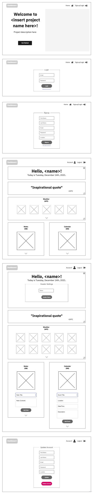

# PROJECT TITLE: TBA

### OVERVIEW

Personal dashboard that aggregates all the information you need for the day. Contains weather (api), upcoming events/to-do-list, notes section

---

### WIREFRAME

---

### USER STORIES
- When I
- When I

---

### ROUTE INVENTORY

List all the routes you plan to have in your backend. Include the http verb, the path, and a brief summary of what the route does. (To represent this nicely in markdown, you might want to look up how to make a table in a markdown file!)

| Route | Path | Description |
| :---: | :---: | :--- |
| POST | /users | Create new user |
| GET | /users | Get user and settings |
| DELETE | /users | Delete user |
| POST | /users/update | Update user information |
| /N
|

---

### DATABASE ERD

Diagram all your tables, columns, and associations. You can use a tool like this https://app.dbdesigner.net/designer/schema/new, and screencap the image.

---

### COMPONENT TREE

Diagram out your component hierarchy, indicating which components are parents/children of which others. Indicate which components hold which pieces of state, and which props are passed to each child.

---

### MVP CHECKLIST

List of all the functionalities that will constitute the bare minimum version of your app. Note that this list should be sized so that you can complete it by ~Monday, leaving Tuesday to tackle stretch goals.

---

### STRETCH GOALS

List of awesome bonus goals you will work on after completing your MVP.

---

